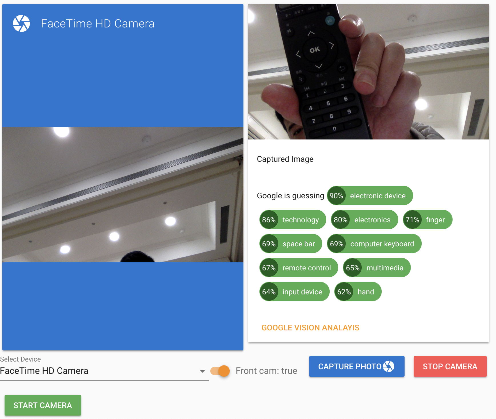

Online : 
  [demo](https://kelvinho.js.org/vue/vue-cam-vision/) 
  [Project Google vision Demo](https://kelvinho.js.org/playground/#/vision)
  [OCR Demo](https://ocr.dogdogbnb.hk/)


<p align="center">
    
</p>

# vue-cam-vision

<!-- [](https://www.npmjs.com/package/vue-web-cam)
[](https://www.npmjs.com/package/vue-web-cam)

[](https://opensource.org/licenses/MIT) -->

Webcam component for VueJs. See [this](http://caniuse.com/#feat=stream)
for browser compatibility.


## Installation

```
npm install vue-cam-vision --save

yarn add vue-cam-vision
```

## Usage

```javascript
// vue page
<template>
    <WebCam
        ref="webcam"
        :deviceId="deviceId"
        width="auto"
        height="100%"
        @cameras="onCameras"
        @camera-change="onCameraChange"
        :isFrontCam="frontCam"
        :googleKey="googleKey"
        >
    </WebCam>
</template>
import { WebCam } from 'vue-cam-vision'

export default {
  data () {
    return {
      captures: [],
      imgReport: [],
      frontCam: false,
      webcam: null,
      img: null,
      camera: null,
      deviceId: null,
      devices: [],
      googleKey: config.googleVisionKey
    }
  },
  components: {
    WebCam
  }
}

// or
import {WebCam} from 'vue-cam-vision'
Vue.component(WebCam.name, WebCam)
```

## Testing & Dev

```
npm run dev
```

### Props

| prop             | type    | default      | notes                     |
| ---------------- | ------- | ------------ | ------------------------- |
| height           | number  | 500          | height of video element   |
| width            | number  | 500          | width of video element    |
| autoplay         | boolean | true         | autoplay attribute        |
| screenshotFormat | string  | 'image/jpeg' | format of screenshot      |
| deviceId         | string  | null         | currently selected camera |
| googleKey        | string  | null         | GOOGLE VISION API KEY     |

### Events

| name           | param    | notes                                                         |
| -------------- | -------- | ------------------------------------------------------------- |
| started        | stream   | emitted once the stream has started                           |
| stopped        | stream   | emitted once the stream has stopped                           |
| error          | error    | emitted if the stream failed to start with the error returned |
| notsupported   | error    | emitted when the browser does not support this feature        |
| cameras        | cameras  | emitted when a list of all cameras available is loaded        |
| camera-change  | deviceId | emitted when camera change occurs                             |

### Methods

| name           | param    | notes                                                                   |
| -------------- | -------- | ----------------------------------------------------------------------- |
| capture        | void     | Capture the current image through the webcam as base64 encoded string   |
| changeCamera   | deviceId | change the currently selected camera. Must pass in the device ID        |
| start          | void     | Programatically Start the camera after stopping it (relies on deviceId prop passed to the component)                     |
| stop           | void     | Programatically stop the camera      |

## License

MIT

## Credits

This is based off [VinceG vue-web-cam](https://github.com/VinceG/vue-web-cam)
[@smronju vue-webcam](https://github.com/smronju/vue-webcam) and [react-webcam](https://github.com/mozmorris/react-webcam)
